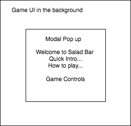
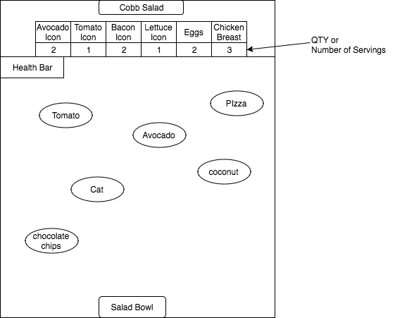
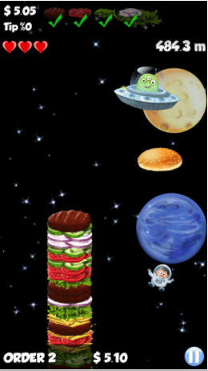

## Salad Bar

### Background

**NB**: You'll probably want to keep the Background section for your production Readme as well.

Salad Bar, inspired by Agario, Scoop, and my daily lunch recipe, involves collecting falling salad ingredients until the user-specified type of salad is made. As ingredients continue to fall from the salad bar, it is the salad bowl holder's duty to catch the necessary ingredients that make up a particular salad type. But...be careful, falling items that do not belong in the salad bowl must be avoided.

As more salad ingredients are collected, the capacity of the salad bowl is reached and the salad bowl size increases, making it more challenging to collect the desired ingredients and avoid non-salad ingredients. Salad Bar follows these rules:

1) Collect desired salad ingredients
2) Avoid collecting non-salad ingredients (i.e. cat, pizza, etc.)
3) Finish salad with all the required ingredients to create chosen salad type.

This simulation will incorporate MVPs outlined in the **Functionality & MVP** and if time permits, the **Bonus Features** sections.

### Functionality & MVP

With this Salad Bar simulator, users will be able to:

- [ ] Start and reset the game
- [ ] Move salad bowl horizontally from one side of map to the other
- [ ] Catch falling salad ingredients in salad bowl, and avoid non-salad ingredients (like pizza)
- [ ] Bowl enlarges as it collects more ingredients

In addition, this project will include:

- [ ] A modal describing the rules of the game, with a start button, and a brief paragraph explaining the game.
- [ ] A production Readme

### Wireframes

This app will consist of a single screen with a Greetings modal (welcome screen) that first displays the instructions and game controls before the start of the game. Once game begins, the game UI will display and the modal closes. There will be nav links to my Github and LinkedIn accounts. Game controls will include left and right directional buttons.

### Greetings Modal

### Game UI

### Screenshot of High Burger mobile app (similar layout)

### Architecture and Technologies

**NB**: one of the main things you should be researching and deciding upon while you write this proposal is what technologies you plan to use.  Identify and create a plan of attack for the major technical challenges in your project.  It's okay if you don't have all the details of implementation fleshed out, but you should have a solid roadmap by Monday morning.

This project will utilize the following technologies:

- Vanilla JavaScript overall structure and game logic,
- `EaselJS` with `HTML5 Canvas` for DOM manipulation and rendering,
- Webpack to bundle the various scripts.

In addition to the webpack entry file, there will be 5 scripts involved in this project:

`main.js`: this script will handle the logic for creating and updating the necessary `Easel.js` elements and rendering them to the DOM.

`Easel.js`
`main.js`
`board.js`
`salad_bowl.js`
`salad_ingredients.js`

### Implementation Timeline

**Day 1**: All Node modules, including webpack, are to be set up. Install EaselJS, gain familiarity with using EaselJS, and drawing using Canvas. Create `webpack.config.js` and `package.json`.  Write entry file and begin coding every script outlined above. Goals for the day:

- Make sure webpack works with all script files.
- Render at least one object and continue experimenting using Canvas and EaselJS.

**Day 2**: Continue learning EaselJS. Be able to create salad bowl object and one salad ingredient. Test to see if falling object can be rendered. Continue researching.

- Render more components to the `Canvas` using `Easel.js`.
- Have salad bowl move horizontally.
- Begin setup of the board and layout of UI.

**Day 3**: Create backend logic, including how to win or lose a game. Create modular functions to handle the algorithm for the ingredients falling from the salad bar at different time intervals, for when ingredient reaches salad bowl, and the salad bowl growing in size.  Goals for the day:

- Successfully render one ingredient falling and bowl catching the ingredient. With bowl growing larger in size.

**Day 4**: Spend today styling the frontend to have it professional and presentable. Make sure users can interact with the game with installed and there are no bugs when users test the game.  Goals for the day:

- Create game controls, and be able to start and reset the game during gameplay. Have multiple users test functionality.
- Style Game UI.

### Bonus features

There are many directions this cellular automata engine could eventually go.  Some anticipated updates are:

- [ ] Incorporate nutrition to score count per ingredient
- [ ] User has ability to select a salad type
- [ ] Add calorie count as health bar
- [ ] Incorporate a timer and/or different stages
