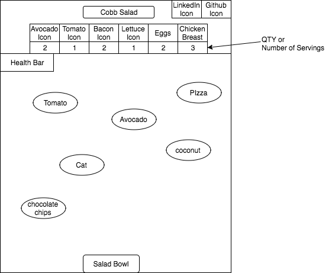

## Salad Bar

### Background

**NB**: You'll probably want to keep the Background section for your production Readme as well.

Salad Bar, inspired by Agario, Scoop, and Tower Stacker, involves the concept of collecting salad ingredients until the specified salad bowl is made. As more salad ingredients are collected, the size of the salad bowl enlarges, making it more challenging to collect the desired ingredients. Salad Bar follows these rules:

1) Collect desired salad ingredients
2) Avoid stacking non-salad ingredients (i.e. cat, pizza, etc.)
3) Finish salad with all the required ingredients to create salad type.

This simulation will incorporate MVPs outlined in the **Functionality & MVP** and if time permits, the **Bonus Features** sections.

### Functionality & MVP

With this Salad Bar simulator, users will be able to:

- [ ] Start and reset the game
- [ ] Ability to move salad bowl horizontally
- [ ] Catch falling salad ingredients in salad bowl, and avoid non-salad ingredients (like pizza)
- [ ] Bowl enlarges as it collects more ingredients (similar to when Mario gets a mushroom and becomes full size)

In addition, this project will include:

- [ ] An About modal describing the background and rules of the game
- [ ] A production Readme

### Wireframes

This app will consist of a single screen with game board, game controls, and nav links to the Github, my LinkedIn,
and the About modal. Game controls will include left and right directional buttons. There will be a modal that displays the rules before start of game.

### Architecture and Technologies

**NB**: one of the main things you should be researching and deciding upon while you write this proposal is what technologies you plan to use.  Identify and create a plan of attack for the major technical challenges in your project.  It's okay if you don't have all the details of implementation fleshed out, but you should have a solid roadmap by Monday morning.

This project will be implemented with the following technologies:

- Vanilla JavaScript and `jquery` for overall structure and game logic,
- `Easel.js` with `HTML5 Canvas` for DOM manipulation and rendering,
- Webpack to bundle and serve up the various scripts.

In addition to the webpack entry file, there will be 5 scripts involved in this project:

`game.js`: this script will handle the logic for creating and updating the necessary `Easel.js` elements and rendering them to the DOM.

`game_view.js`
`salad_bowl.js`
`moving_object.js`
`salad_ingredients.js`

### Implementation Timeline

**Day 1**: Setup all necessary Node modules, including getting webpack up and running and `Easel.js` installed.  Create `webpack.config.js` as well as `package.json`.  Write a basic entry file and the bare bones of all 3 scripts outlined above.  Learn the basics of `Easel.js`.  Goals for the day:

- Get a green bundle with `webpack`
- Learn enough `Easel.js` to render an object to the `Canvas` element

**Day 2**: Dedicate this day to learning the `Easel.js` API.  First, build out the `Cell` object to connect to the `game` object. 

- Complete the `game.js` module (constructor, update functions)
- Render a square grid to the `Canvas` using `Easel.js`

**Day 3**: Create the logic backend.  Build out modular functions for handling the different grid types along with their unique neighbor checks and rule sets.  Incorporate the logic into the `game.js` rendering.  Goals for the day:

- Have a functional grid on the `Canvas` frontend that correctly handles iterations from one generation of the game to the next

**Day 4**: Install the controls for the user to interact with the game.  Style the frontend, making it polished and professional.  Goals for the day:

- Create controls for start, reset
- Have a styled `Canvas`, nice looking controls and title

### Bonus features

There are many directions this cellular automata engine could eventually go.  Some anticipated updates are:

- [ ] Incorporate a score count
- [ ] User has ability to select a salad type
- [ ] Add calorie count as health bar
