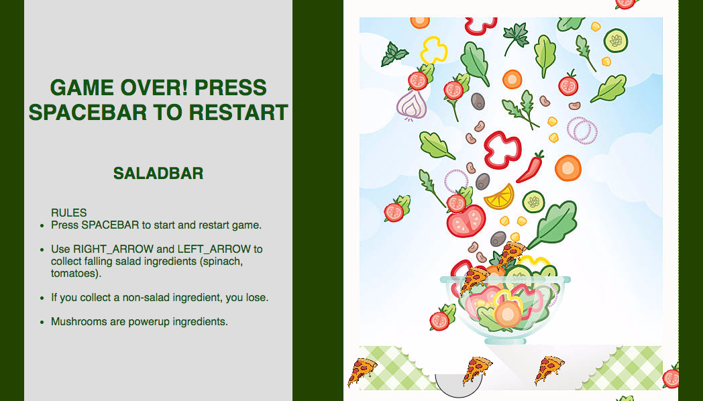

## Salad Bar

[Play SaladBar!](https://gevuong.github.io/SaladBar/)
### Background

**NB**: You'll probably want to keep the Background section for your production Readme as well.

Salad Bar, inspired by Agario, Scoop, and my daily lunch recipe, involves collecting falling salad ingredients until all salad ingredients are made. As ingredients continue to fall from the salad bar, it is the salad bowl holder's duty to catch the necessary ingredients. But...be careful, falling items that do not belong in the salad bowl must be avoided.

As more salad ingredients are collected, the capacity of the salad bowl increases, making it more challenging to dodge non-salad ingredients.

### Features and Implementation

With the Salad Bar simulator, users are able to:

- [ ] Start and reset the game
- [ ] Move salad bowl horizontally from one side of map to the other
- [ ] Catch falling salad ingredients in salad bowl, and dodge non-salad ingredients
- [ ] Bowl enlarges as it collects more ingredients

In addition, this project include:

- [ ] Rules of the game, with a start button, and a brief paragraph explaining the game.

### Game User Interface

### Architecture and Technologies

This project utilizes the following technologies:

- Javascript and Vanilla JavaScript
- `p5.js` library

5 scripts involved in this project:

`main.js`: this script will handle the logic for creating and updating the necessary `sketch.js` elements and rendering them to the DOM.

`sketch.js`
`main.js`
`board.js`
`salad_bowl.js`
`salad_ingredients.js`

### Future Direction
Some anticipated updates are:

- [ ] Add a timer and/or different stages
- [ ] Incorporate nutrition to score count per ingredient
- [ ] Diversify falling ingredients
- [ ] User has ability to select a salad type
- [ ] Add calorie count as health bar
